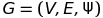
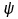

<h1 align="center"><strong>Graph Theory</strong></h1>
Exploring graph theory in mathematical way 
<h2>Goal</h2>
Modeling problem as a graph is a very important technique in problem solving. Since we can nicely simplify the problem into basic components: nodes(or vertices) and edges, where a node in a graph can represent an object and an edge can represent some sort of relation between the objects. Further more, once we represent the problem as a graph, we can apply the mathematical graph theory(which has lots of nice properties about different kinds of graphs and so on.) to analyze the problem and possibly come up with a effective solution. 
<h2>Types of Graphs</h2>

In general, by formal definition, a graph is <strong>an order triple</strong> , where <strong>V</strong> is a <strong>non-empty set of vertices(points)</strong>, <strong>E</strong> is a set of edges (lines) disjoint from V, and  is a function that assigns to each edge, a pair of vertices (v,v’).

<h3>Directed graph</h3>

A graph in which the edges are directed by arrows, indicating that the relationship, represented by the edge, only applies from one vertex to the other, but not the other way around. In other words, if a directed edge has an arrow from A to B, A is related to B, but B is not related to A.

In formal terms, a directed graph is an ordered pair G = (V, A) where
<ul>
  <li>V is a set whose elements are called vertices, nodes, or points;</li>
  <li>A is a set of ordered pairs of vertices, called arrows, directed edges (sometimes simply edges with the corresponding set named E instead of A), directed arcs, or directed lines.</li>
</ul>
</p
